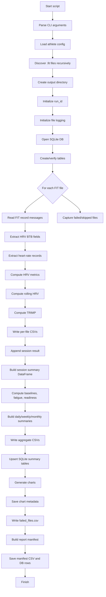
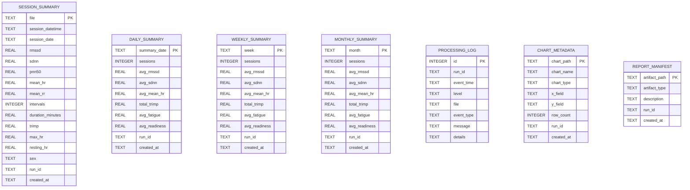

# Garmin HRV Batch Analysis v6

`garmin_hrv_batch_analysis_v6.py` is a batch-processing pipeline for Garmin FIT activity files that extracts beat-to-beat HRV intervals, calculates HRV and training-load metrics, generates charts, stores summaries in SQLite, and creates run-level audit artifacts.

---

## 1. Purpose

The script processes Garmin `.fit` files containing HRV developer fields such as:

- `hrv btb (ms)`
- `hrv beat2beat int(ms)`

It produces:

- per-session HRV metrics
- rolling HRV CSV files
- TRIMP-based training load
- fatigue and readiness scores
- daily, weekly, and monthly summaries
- PNG charts
- SQLite tables in `Hydra.db`
- processing logs
- failed-file reports
- chart metadata
- report manifest metadata

---

## 2. Installation

```bash
pip install fitdecode pandas numpy matplotlib
```

---

## 3. Basic Usage

```bash
python garmin_hrv_batch_analysis_v6.py input_folder
```

With athlete config:

```bash
python garmin_hrv_batch_analysis_v6.py input_folder --config athlete_config.json --athlete stelios
```

With explicit output and database paths:

```bash
python garmin_hrv_batch_analysis_v6.py input_folder ^
  --config athlete_config.json ^
  --athlete stelios ^
  --output-dir c:/smakrykoOutputs/hrv_output ^
  --db-path c:/smakrykoDBs/Hydra.db
```

Debug FIT record fields:

```bash
python garmin_hrv_batch_analysis_v6.py input_folder --debug-record-fields
```

---

## 4. Athlete Config

Example `athlete_config.json`:

```json
{
  "default": {
    "resting_hr": 52,
    "max_hr": 190,
    "sex": "male"
  },
  "athletes": {
    "stelios": {
      "resting_hr": 50,
      "max_hr": 188,
      "sex": "male"
    }
  }
}
```

Config values are used for TRIMP calculation.

---

## 5. Execution Flow



---

## 6. Input

The script expects a folder containing Garmin `.fit` files.

```text
input_folder/
├── activity_001.fit
├── activity_002.fit
└── subfolder/
    └── activity_003.fit
```

The script scans recursively:

```python
input_path.rglob("*.fit")
```

---

## 7. Output Folder Structure

By default, outputs are written to:

```text
<input_folder>/hrv_output/
```

Or to the folder specified by:

```bash
--output-dir
```

Example:

```text
hrv_output/
├── hrv_pipeline.log
├── failed_files.csv
├── report_manifest.csv
├── batch_summary_with_fatigue_readiness_trimp.csv
├── daily_hrv_trends.csv
├── weekly_hrv_trends.csv
├── monthly_hrv_trends.csv
├── demoHRV_rr.csv
├── demoHRV_rolling.csv
├── demoHRV_summary.csv
└── charts/
    ├── 01_rmssd_over_time.png
    ├── 02_fatigue_over_time.png
    ├── 03_readiness_over_time.png
    ├── 04_trimp_over_time.png
    ├── 05_trimp_vs_rmssd.png
    ├── 06_weekly_rmssd.png
    ├── 07_weekly_fatigue_readiness.png
    └── 08_monthly_trimp.png
```

---

## 8. Main CSV Outputs

### Per-session batch summary

`batch_summary_with_fatigue_readiness_trimp.csv`

Contains one row per successfully processed FIT file.

Main fields:

- `file`
- `datetime`
- `date`
- `rmssd`
- `sdnn`
- `pnn50`
- `mean_hr`
- `mean_rr`
- `intervals`
- `duration_minutes`
- `trimp`
- `fatigue_score`
- `fatigue_label`
- `readiness_score`

### Daily summary

`daily_hrv_trends.csv`

One row per date.

### Weekly summary

`weekly_hrv_trends.csv`

One row per calendar week period.

### Monthly summary

`monthly_hrv_trends.csv`

One row per month.

### Failed files

`failed_files.csv`

Fields:

- `file`
- `error_type`
- `error_message`

### Report manifest

`report_manifest.csv`

Fields:

- `artifact_path`
- `artifact_type`
- `description`
- `run_id`

---

## 9. Logging

The script writes operational logs to:

```text
hrv_output/hrv_pipeline.log
```

Example log lines:

```text
2026-04-26 11:02:15 | INFO | Run started. run_id=...
2026-04-26 11:02:16 | INFO | Processing file: demoHRV.fit
2026-04-26 11:02:17 | INFO | Processed successfully: demoHRV.fit
```

Logs are also stored in SQLite table:

```sql
processing_log
```

---

## 10. Database

Default SQLite path:

```text
c:/smakrykoDBs/Hydra.db
```

Override with:

```bash
--db-path c:/path/to/Hydra.db
```

---

## 11. SQLite Schema

### Entity Relationship Overview



---

### `session_summary`

One row per successfully processed FIT file.

```sql
CREATE TABLE IF NOT EXISTS session_summary (
    file TEXT PRIMARY KEY,
    session_datetime TEXT,
    session_date TEXT,
    rmssd REAL,
    sdnn REAL,
    pnn50 REAL,
    mean_hr REAL,
    mean_rr REAL,
    intervals INTEGER,
    duration_minutes REAL,
    trimp REAL,
    max_hr REAL,
    resting_hr REAL,
    sex TEXT,
    run_id TEXT,
    created_at TEXT DEFAULT CURRENT_TIMESTAMP
);
```

Primary key: `file`

Rerunning the same file updates the same row.

---

### `daily_summary`

One row per date.

```sql
CREATE TABLE IF NOT EXISTS daily_summary (
    summary_date TEXT PRIMARY KEY,
    sessions INTEGER,
    avg_rmssd REAL,
    avg_sdnn REAL,
    avg_mean_hr REAL,
    total_trimp REAL,
    avg_fatigue REAL,
    avg_readiness REAL,
    run_id TEXT,
    created_at TEXT DEFAULT CURRENT_TIMESTAMP
);
```

---

### `weekly_summary`

One row per week.

```sql
CREATE TABLE IF NOT EXISTS weekly_summary (
    week TEXT PRIMARY KEY,
    sessions INTEGER,
    avg_rmssd REAL,
    avg_sdnn REAL,
    avg_mean_hr REAL,
    total_trimp REAL,
    avg_fatigue REAL,
    avg_readiness REAL,
    run_id TEXT,
    created_at TEXT DEFAULT CURRENT_TIMESTAMP
);
```

---

### `monthly_summary`

One row per month.

```sql
CREATE TABLE IF NOT EXISTS monthly_summary (
    month TEXT PRIMARY KEY,
    sessions INTEGER,
    avg_rmssd REAL,
    avg_sdnn REAL,
    avg_mean_hr REAL,
    total_trimp REAL,
    avg_fatigue REAL,
    avg_readiness REAL,
    run_id TEXT,
    created_at TEXT DEFAULT CURRENT_TIMESTAMP
);
```

---

### `processing_log`

Append-only processing log.

```sql
CREATE TABLE IF NOT EXISTS processing_log (
    id INTEGER PRIMARY KEY AUTOINCREMENT,
    run_id TEXT,
    event_time TEXT DEFAULT CURRENT_TIMESTAMP,
    level TEXT,
    file TEXT,
    event_type TEXT,
    message TEXT,
    details TEXT
);
```

Typical event types:

- `file_start`
- `file_success`
- `file_skip`
- `file_error`

---

### `chart_metadata`

One row per generated chart.

```sql
CREATE TABLE IF NOT EXISTS chart_metadata (
    chart_path TEXT PRIMARY KEY,
    chart_name TEXT,
    chart_type TEXT,
    x_field TEXT,
    y_field TEXT,
    row_count INTEGER,
    run_id TEXT,
    created_at TEXT DEFAULT CURRENT_TIMESTAMP
);
```

---

### `report_manifest`

One row per generated artifact.

```sql
CREATE TABLE IF NOT EXISTS report_manifest (
    artifact_path TEXT PRIMARY KEY,
    artifact_type TEXT,
    description TEXT,
    run_id TEXT,
    created_at TEXT DEFAULT CURRENT_TIMESTAMP
);
```

Artifact types include:

- `csv`
- `chart`
- `log`

---

## 12. Write Behavior

The script uses SQLite upserts:

```sql
ON CONFLICT(primary_key) DO UPDATE
```

This means:

- repeated runs update existing summary rows
- `processing_log` remains append-only
- chart metadata updates by `chart_path`
- report manifest updates by `artifact_path`

---

## 13. Metrics

### RMSSD

```text
RMSSD = sqrt(mean(diff(RR)^2))
```

### SDNN

Standard deviation of RR intervals.

### pNN50

Percentage of successive RR interval differences greater than 50 ms.

### TRIMP

Heart-rate reserve:

```text
HRr = (HR - resting_hr) / (max_hr - resting_hr)
```

Male coefficient:

```text
TRIMP factor = HRr * 0.64 * exp(1.92 * HRr)
```

Female coefficient:

```text
TRIMP factor = HRr * 0.86 * exp(1.67 * HRr)
```

---

## 14. Example SQL Queries

### Latest sessions

```sql
SELECT
    file,
    session_datetime,
    rmssd,
    sdnn,
    mean_hr,
    trimp,
    run_id
FROM session_summary
ORDER BY session_datetime DESC
LIMIT 20;
```

### Daily HRV trend

```sql
SELECT
    summary_date,
    sessions,
    ROUND(avg_rmssd, 2) AS avg_rmssd,
    ROUND(avg_sdnn, 2) AS avg_sdnn,
    ROUND(total_trimp, 2) AS total_trimp,
    ROUND(avg_fatigue, 2) AS avg_fatigue,
    ROUND(avg_readiness, 2) AS avg_readiness
FROM daily_summary
ORDER BY summary_date;
```

### Weekly training load

```sql
SELECT
    week,
    sessions,
    ROUND(total_trimp, 2) AS total_trimp,
    ROUND(avg_rmssd, 2) AS avg_rmssd,
    ROUND(avg_fatigue, 2) AS avg_fatigue
FROM weekly_summary
ORDER BY week DESC;
```

### Monthly summary

```sql
SELECT
    month,
    sessions,
    ROUND(avg_rmssd, 2) AS avg_rmssd,
    ROUND(total_trimp, 2) AS total_trimp,
    ROUND(avg_readiness, 2) AS avg_readiness
FROM monthly_summary
ORDER BY month DESC;
```

### Failed or skipped files

```sql
SELECT
    event_time,
    file,
    event_type,
    message,
    details
FROM processing_log
WHERE event_type IN ('file_skip', 'file_error')
ORDER BY event_time DESC;
```

### Processing success count by run

```sql
SELECT
    run_id,
    event_type,
    COUNT(*) AS events
FROM processing_log
GROUP BY run_id, event_type
ORDER BY run_id, event_type;
```

### Charts generated in latest run

```sql
SELECT
    chart_name,
    chart_type,
    chart_path,
    x_field,
    y_field,
    row_count
FROM chart_metadata
WHERE run_id = (
    SELECT run_id
    FROM processing_log
    ORDER BY event_time DESC
    LIMIT 1
)
ORDER BY chart_name;
```

### Report artifacts for latest run

```sql
SELECT
    artifact_type,
    description,
    artifact_path
FROM report_manifest
WHERE run_id = (
    SELECT run_id
    FROM processing_log
    ORDER BY event_time DESC
    LIMIT 1
)
ORDER BY artifact_type, artifact_path;
```

### Best HRV sessions

```sql
SELECT
    file,
    session_date,
    ROUND(rmssd, 2) AS rmssd,
    ROUND(sdnn, 2) AS sdnn,
    ROUND(mean_hr, 2) AS mean_hr,
    ROUND(trimp, 2) AS trimp
FROM session_summary
WHERE rmssd IS NOT NULL
ORDER BY rmssd DESC
LIMIT 10;
```

### Highest training-load sessions

```sql
SELECT
    file,
    session_date,
    ROUND(trimp, 2) AS trimp,
    ROUND(rmssd, 2) AS rmssd,
    ROUND(mean_hr, 2) AS mean_hr
FROM session_summary
WHERE trimp IS NOT NULL
ORDER BY trimp DESC
LIMIT 10;
```

### Low HRV + high TRIMP warning sessions

```sql
SELECT
    file,
    session_date,
    ROUND(rmssd, 2) AS rmssd,
    ROUND(trimp, 2) AS trimp,
    ROUND(mean_hr, 2) AS mean_hr
FROM session_summary
WHERE rmssd < 20
  AND trimp > 80
ORDER BY session_date DESC;
```

---

## 15. Recommended Power BI Tables

Connect Power BI to `Hydra.db` and import:

- `session_summary`
- `daily_summary`
- `weekly_summary`
- `monthly_summary`
- `chart_metadata`
- `processing_log`

Recommended visuals:

| Visual | Table | Fields |
|---|---|---|
| HRV trend | `daily_summary` | `summary_date`, `avg_rmssd` |
| Training load | `weekly_summary` | `week`, `total_trimp` |
| Readiness score | `daily_summary` | `summary_date`, `avg_readiness` |
| Fatigue trend | `daily_summary` | `summary_date`, `avg_fatigue` |
| Session scatter | `session_summary` | `trimp`, `rmssd` |
| Processing audit | `processing_log` | `event_time`, `file`, `event_type` |

---

## 16. Current Limitations

- Fatigue and readiness are heuristic, not clinical.
- TRIMP accuracy depends on correct `resting_hr` and `max_hr`.
- HRV during exercise is not equivalent to resting HRV.
- `session_summary.file` assumes filenames are unique.
- No raw RR interval table is stored in SQLite yet.
- No PDF report is generated yet.

---

## 17. Recommended Next Enhancements

1. Add `rr_interval_raw` SQLite table.
2. Add `rolling_hrv` SQLite table.
3. Add unique file hash to avoid filename collision.
4. Add PDF report generation.
5. Add Power BI template.
6. Add scheduled processing for a Garmin export folder.
7. Add athlete dimension table.
8. Add run history table.

---

## 18. Troubleshooting

### No HRV data found

Run:

```bash
python garmin_hrv_batch_analysis_v6.py input_folder --debug-record-fields
```

Look for fields similar to:

- `hrv btb (ms)`
- `hrv beat2beat int(ms)`

If your file uses another field name, update:

```python
is_hrv_btb_field()
```

### Database not created

Check:

- `--db-path` folder exists
- user has write permissions
- file is not locked by another process

### Charts not created

Check:

- `matplotlib` is installed
- output directory is writable
- at least one FIT file processed successfully

### TRIMP seems wrong

Set explicit athlete config:

```json
{
  "default": {
    "resting_hr": 52,
    "max_hr": 190,
    "sex": "male"
  }
}
```

---

## 19. Example Full Command

```bash
python garmin_hrv_batch_analysis_v6.py c:/Garmin/FIT ^
  --config c:/Garmin/athlete_config.json ^
  --athlete stelios ^
  --output-dir c:/Garmin/hrv_output ^
  --db-path c:/smakrykoDBs/Hydra.db
```

---

## 20. Usage Note

This pipeline is intended for personal fitness analytics and engineering experimentation. It is not a medical diagnostic tool.
